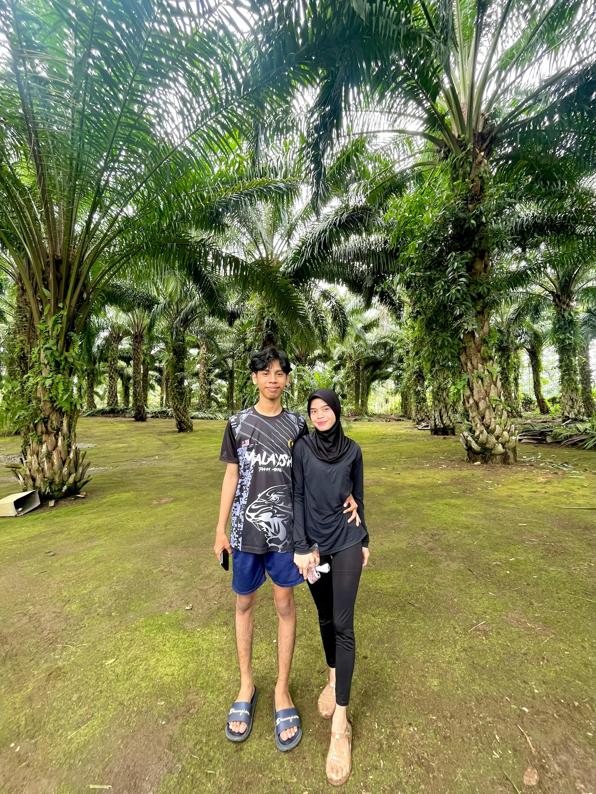
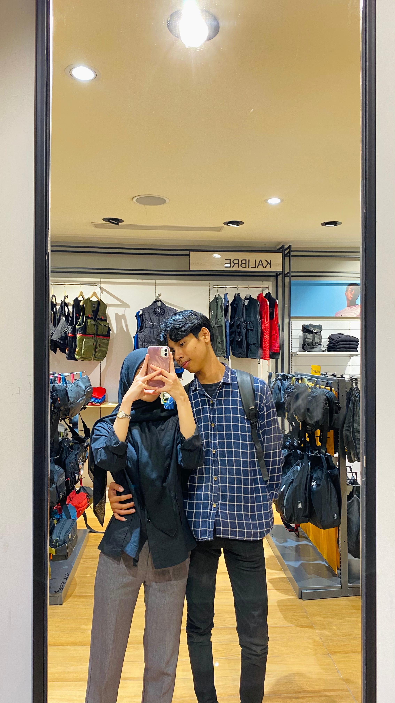
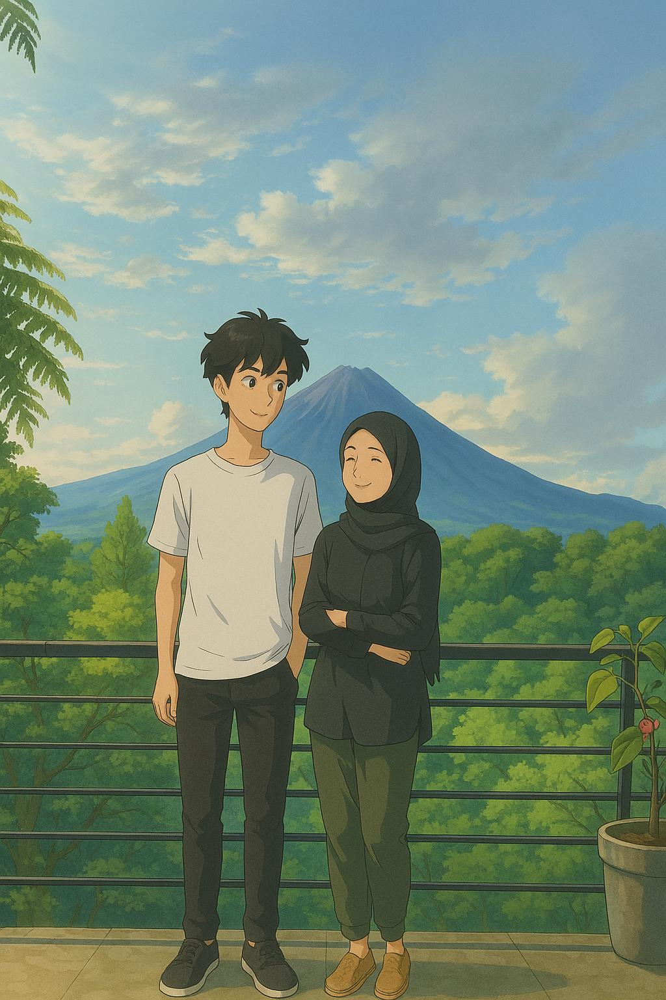
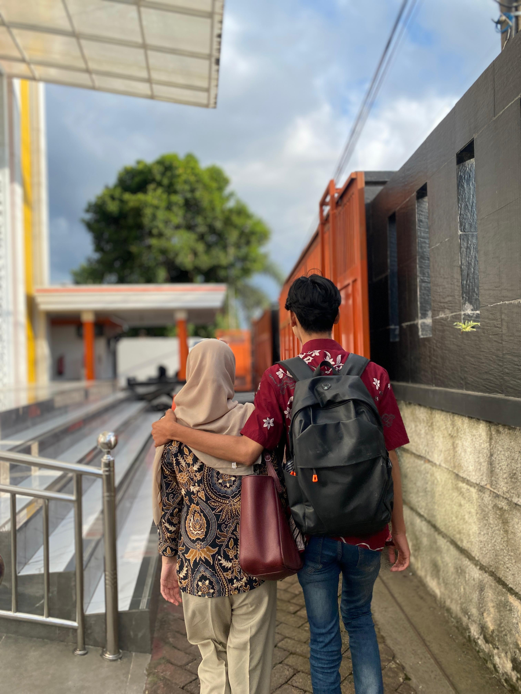

<html lang="id">
<head>
  <meta charset="UTF-8" />
  <meta name="viewport" content="width=device-width, initial-scale=1, maximum-scale=1" />
  <title>Selamat Ulang Tahun, Sayang!</title>
  
</head>
<body>
  

    <h1>Selamat Ulang Tahun, Sayangku!</h1>
    <h2 id="tanggalHariIni"></h2>
    

      Semoga hari ulang tahunmu dipenuhi dengan kebahagiaan, cinta, dan harapan yang indah. 
      Aku sangat beruntung memilikimu di hidupku. Terima kasih sudah menjadi cahaya dalam duniaku. 
      Aku mencintaimu selamanya. ❤️
    

    
    

      <button type="button" id="toggleAudio">Putar Lagu: You'll Be In My Heart ❤️</button>
       
      <button class="toggle-album-btn" id="showAlbumBtn">Tampilkan Album Foto & Video 📸🎥</button>
      <audio id="music" loop preload="auto">
        <source src="audio/lagu1.mp3.mp3" type="audio/mpeg" />
        Browser Anda tidak mendukung audio.
      </audio>
    

  

  

    <h2 class="album-title">Album Kenangan Foto & Video</h2>
    

      

        
        
poto paling fav

      

      

        
        
miror nya gacorr habiss

      

      

        
        
animasi dari orang tersayangg

      

      

        
        
poto best di kampus

      

      

        <video controls alt="Video Kenangan 1">
          <source src="foto/vidio1.mp4" type="video/mp4" />
          Browser Anda tidak mendukung video.
        </video>
        
seseru itu hujan"an di pantai

      

      

        <video controls alt="Video Kenangan 2">
          <source src="foto/vidio2.mp4" type="video/mp4" />
          Browser Anda tidak mendukung video.
        </video>
        
omagaa

      

    

    <button class="toggle-album-btn" id="backBtn">Kembali ke Halaman Utama</button>
  

  

